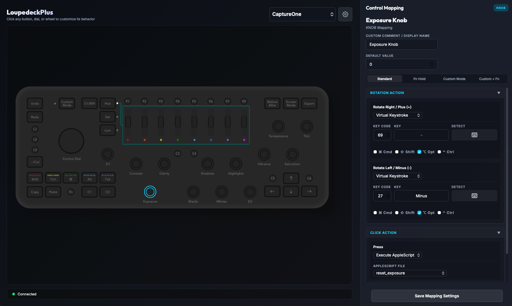

# LoupdeckPlus
A MacOs app to replace the official Loupedeck software.



## Features

* GUI configuration editor
* Live preview of control assignments
* Save and load configurations
* Support for custom profiles
* Allow to bind Loupedeck controls to keyboard shortcuts and AppleScripts
* Adobe Lightroom Classic plugin with socket client
* Support for CaptureOne custom keyaboard shortcuts (no plugin used) 
* Support live profile switching - using bundle id of applications


##⚠️ For Loupedeck+ 5.9.1 users

If you have not updated your Loupedeck+ to version 6.X or later, your system has already bundled with "loupedeck2" Lightroom plugin and "Loupedeck Default" keyboard profile for CaptureOne, as part of the original Loupedeck software. You can use LoupedeckPlus directly without any configuration.

If for some reason you need to start fresh, just run the app and it install all the plugins and keyboard profiles for you. 

## Installation

In Release section download a zipped app for your architecture (arm64 or x64). 

Place it in Applications folder and run it. You may need to grant permissions to control input devices and accessibility.

### CaptureOne users

CaptureOne integration works by assigning keyboard shortcuts to Loupedeck controls. For enable it, go to Edit > Keyboard Shortcuts... in CaptureOne and select "LoupedeckPlus" profile.

Note! Color wheels are mapped as a ColorEditor in Capture One usign apple scripts, since there is no hotkeys assigned for color wheels in Capture One. Note, that in version 16.3.8 (which I use) there is no Apple Script support for the color wheels, so it will not work. But in later versions (tested on 16.8.0) it works as expected.

Custom apple scripts as well as current configuration files are stored in "~/.config/loupedeck-plus/". There is a default set of apple scripts for you to start with. If you want to install a custom apple script, place it in "~/.config/loupedeck-plus/scripts/custom" and restart an app - it will be automatically detected and available to map on a control.

### Lightroom users

Lightroom integration works by using a plugin that communicates with the daemon via a socket. Make sure that Lightroom is authorized to control your system by going to System Preferences > Security & Privacy > Accessibility and check the box next to Lightroom.

Go to File > Plugin Manager and activate "loupedeckPlus" plugin.

## How to use it

I try to mimic the official software layout and UX as much as possible, but keep it simple and straightforward. The daemon is running in background and you can use it from menu bar if you want. But it is not mandatory - you can just use the app for configuration.

For all Loupedeck+ controls the app has press and release mappings, with exception of knobs that also have plus and minus mappings. Lightroom is a special case, since the controls are based on socket command, there is dedicated option there -- "socket command" which accept Lightroom command. For other app's custom commands you can see available options in Adobe's documentation: https://developer.adobe.com/

Custom Mode button switch the layout and enable a map another set of mappings. Fn key enable yet another set of mappings and act like a modifier.

Different behavior of --/Col button - it does not acts like in original software (which in default CaptureOne profile switch betweer stars and color tags) but act as a normal button and not a toggle.

## Motivation and plans

The main motivation for this project is to create a more lightweight alternative to the official Loupedeck software. I wrote this app for myself, as I am active Capture One user and I would like to have a better integration with my Loupedeck+. Since Apple soon will drop support for Intel Macs I decided to ditch the official software and make a lightweight version of it in Swift, because last reliable version of Loupedeck software (5.9.1) soon will not run on new macOS versions.

Since I switched to Capture One 26 couple of years ago, I no longer use Lightroom. This is why the support for it may not be as good as it could be. I will NOT maintain it, but if you are a Lightroom user and you need more features, feel free to fork the project and add them.

There is no any plans to support other plugins than CaptureOne and Lightroom, but feel free to add them if you need it.

There is also no plans to support other hardware than Loupedeck+.

Also, there is no any plans to make Windows or Linux version of this software.

## Building instructions

Clone the repository:

```bash
git clone "https://github.com/vadimkozhin/LoupedeckPlus.git"
cd "LoupedeckPlus"
```

Run the build script and see available options:

```bash
./build.sh -h
```

```bash
--arch <arm64|x86_64>   Build for a specific architecture (default: arm64)
--install               Install the compiled app into the /Applications directory
--release               Zip the app bundle and place it in the 'release' directory
--clean                 Clean all build artifacts (can be combined with other options)
-h, --help              Show this help message
```

## Version History

0.5.1 - public release
